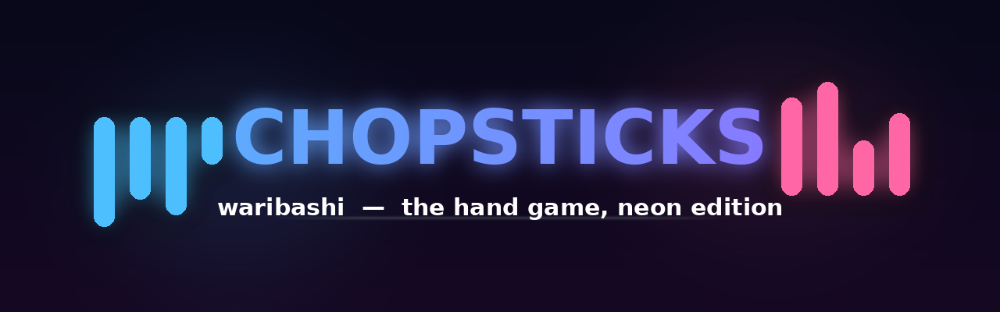
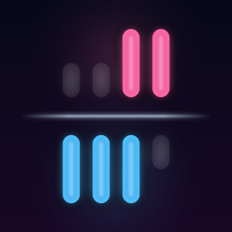

# Chopsticks（割り箸）



指遊び「割り箸（チョップスティックス）」のiOSアプリ。SwiftUI製。

- **ランク戦**: CPU Lv.1〜10を勝ち上がるラダー
- **フリー対戦**: CPU難易度3段階（かんたん／つよい／鬼）
- **2人対戦**: 1台で対面プレイ
- **近くの人と対戦**: Multipeer Connectivity（Wi-Fi/Bluetooth）
- **オンライン対戦**: Game Center マッチメイキング

## 遊び方

- 各プレイヤーは手（デフォルト2本）を持ち、指1本ずつでスタート
- 自分の手を選んでから相手の手をタップすると、攻撃側の指の本数が相手の手に加算される
- 指が5本になった手は死亡。全ての手が死んだプレイヤーの負け
- 相打ち（両者全滅）は、とどめを刺した手番側の勝ち
- 60ターンで決着しない場合はサドンデス判定（生きてる手の数 → 指の合計が少ない方 → 引き分け）
- 2人対戦・マルチプレイの再戦は先手を交代

## ルールオプション

| ルール | 内容 |
|---|---|
| オーバーフロー | ON: 5を超えたら余りでループ、ちょうど5で死亡 ／ OFF: 5以上で即死亡（クラシック） |
| 分割 | 攻撃の代わりに自分の指を手の間で再分配（並べ替えだけの分割は不可） |
| 復活 | 分割で死亡した手に指を割り当てて復活できる |
| 手の数 | 2本／3本 |
| 毒 | 指1本の攻撃で相手の手を即死。ただし毒を使った手も死ぬ相討ち（ノーリスク即死だと先手必勝になるため） |
| 爆弾 | ちょうど4本になった手は爆発して死に、他の全ての手に1ダメージ（連鎖あり）。分割パネルに事前警告あり |
| ミラー | 攻撃した本数が自分の手にも加算される |
| ダブルタップ | 1ターンに2回攻撃できる |

## 楽しさを支える仕掛け

- **🏆 ランク戦**: CPU Lv.1〜10を勝ち上がるラダー。勝つたびにCPUが強くなる（ランダム行動率が下がり、読みが深くなる）。攻略の公平性のため標準ルール固定
- **🎯 今日の挑戦**: 日付シードで全ユーザーに同じ日替わりルールが配られるデイリーチャレンジ。1日1回のクリア記録で毎日開く理由を作る
- **💡 ヒント**: CPU戦で電球ボタンを押すと、AIが計算した最善手の「攻撃する手」と「狙う手」が黄色く光る（分割が最善ならバナーで教える）
- **⏸️ 中断再開**: 進行中のCPU戦・2人対戦は自動保存され、メニューの「続きから」でいつでも再開できる（CPUの手番で中断しても再開時に続きから考え始める）
- **📊 戦績画面**: ランク進行バー・勝敗・勝率・連勝・連続プレイ日数を一覧、リセットも可能。Game Centerダッシュボード（リーダーボード・実績）への導線つき
- **🔊 効果音**: タップ・撃破・爆発・毒・勝利・ランクアップなど9種の合成サウンド。設定でOFFにでき、サイレントスイッチ・再生中の音楽を尊重
- **連勝ストリーク・連続プレイ日数**: CPU戦の勝敗・連勝・自己ベスト・デイリー記録を永続化し、メニューとリザルトに表示
- **初回コーチマーク**: 初プレイの2手番だけ「手を選ぶ→攻撃」を対話的に誘導（設定から再表示可能）
- **演出**: 手が死ぬと画面シェイク＋「BREAK! / POISON! / BOOM!」のイベントバナー、指4本のリーチは赤く警告パルス。中央バーに常時ターン数を表示し、判定10ターン前から黄色く警告
- **PERFECT勝利・RANK UP・記録更新**の称賛、敗北時は「リベンジ!」ボタンで再戦を促す
- **結果シェア**: 勝利リザルトからランク撃破・連勝を共有（ShareLink）
- **レビュー依頼**: 3連勝またはランクLv.3到達など「気分が良い瞬間」にのみ、バージョンごとに1回（requestReview）
- **🎲おまかせルール**: 特殊ルールをランダムに組み合わせて毎回違うゲームに
- **アクセシビリティ**: 全ての手にVoiceOverラベル（「Player 1の左の手、指2本」）、Reduce Motion設定で画面シェイクを無効化
- **マルチプレイの品質**: ゲスト側も自分の手が手前に表示され、お互いの表示名が見える。リマッチは盤面を確実に同期し先手を交代。接続直後のメッセージ取りこぼしもバッファリングで防止
- **📖 攻略ガイド**: キル計算・即死圏・分割・ループ・特殊ルール別のコツを図解で解説。CPUに負けた直後のリザルトからも開けて「悔しい→上達」の導線に
- **🎁 報酬テーマ**: 「今日の挑戦」を通算7回クリアすると限定テーマ「ミッドナイト」を解放（課金不要の実績報酬）
- **💎 プレミアム（IAP）**: プレミアムテーマ5種（サンセット/マトリックス/サクラ/ゴールド/ディープシー）解放＋AIヒント無制限の買い切り。投げ銭も。ゲームプレイ自体は無料で全部遊べる設計
- **🌍 日英対応**: 日本語・英語の2言語をサポート（`tools/localization/`の機械検証で翻訳欠落0を維持）
- **🎬 リプレイ**: 対局後に全手順を1手ずつ／自動再生で振り返れる（あの逆転の一手をもう一度）
- **🔔 デイリーリマインダー**: 連続プレイ日数が途切れる前にお知らせ（オプトイン）

## CPU難易度

- **かんたん**: ランダムに行動
- **つよい**: 反復深化αβ探索（持ち時間200ms・最大10手読み）
- **鬼**: 反復深化αβ探索（持ち時間450ms・最大16手読み）。勝てたら自慢していい

AIは反復深化＋持ち時間制なので、盤面の複雑さによらず応答時間が一定。
即キル手を優先するムーブオーダリング、手数差・リーチ・テンポ（手番側の即キル脅威）・
分割リソースを見る評価関数を持つ。探索はバックグラウンドで実行されUIを塞がない。

ランク戦はLv.1（76%ランダム・2手読み）→Lv.10（0%ランダム・11手読み）まで段階的に強くなる。

## アーキテクチャ

```
Chopsticks/
├── App/            エントリポイント
├── Models/         ゲームルール（純粋なロジック、UI非依存）
│   ├── GameState   盤面＋ルール適用（apply(_:)に一元化）
│   ├── Player / Hand
│   ├── GameAction  タップ／分割
│   └── GameConfig  ルール設定
├── AI/             AIEngine（行動生成＋反復深化αβ探索）
├── ViewModels/     GameViewModel（@Observable、手番進行・演出・自動保存）
├── Views/          SwiftUI画面・コンポーネント・エフェクト
├── Networking/     Multipeer / Game Center（メッセージバッファリング付き）
├── Sounds/         効果音（合成WAV）
├── Utilities/      テーマ・戦績・設定・サウンド・ハプティクス・中断保存
└── ChopsticksTests/ ユニットテスト（ルール・AI・ViewModel）
```

ルールの適用は `GameState.apply(_:)` に一元化されており、実プレイとAIのシミュレーションが必ず同じ挙動になる。

## テスト

`ChopsticksTests` にゲームルール・AI・ViewModel・マルチプレイ・ストアのユニットテスト69件。

- ルール: wrap/クラシック死亡・毒相討ち・ミラー自滅・爆弾連鎖（全滅4連鎖含む）・分割検証・Codable往復・日替わりチャレンジの決定性
- AI: 行動生成・キル手オーダリング・1手勝ちの認識・即負け回避・全ルール組合せの妥当性・応答時間
- ViewModel: 決着フロー・PERFECT判定・ダブルタップ・再戦の先手交代・決着後の操作無効・サドンデス・リプレイの完全一致
- マルチプレイ: メッセージ同期・リマッチの盤面配布・切断（モックサービス）
- ストア: 連続プレイ日数・ランク進行・ヒント回数・テーマ解放・中断保存の日付境界（UserDefaults隔離スイート＋日付注入）
- ファズ: シード固定のランダム40局（ルール組合せ×ランダム合法手）で指の範囲・死んだ手の不変性・ターン進行・Codable往復・リプレイ完全一致を毎局検証

Xcodeで `Cmd+U`、またはCI（GitHub Actions・iOSシミュレータ）で自動実行される。

## ビルド

- Xcode 16 / iOS 17.0+
- `Chopsticks/Chopsticks.xcodeproj` を開いてそのままビルド
- プロジェクト定義は [XcodeGen](https://github.com/yonaskolb/XcodeGen)（`Chopsticks/project.yml`）でも管理。ファイル追加時は `cd Chopsticks && xcodegen` で再生成できる
